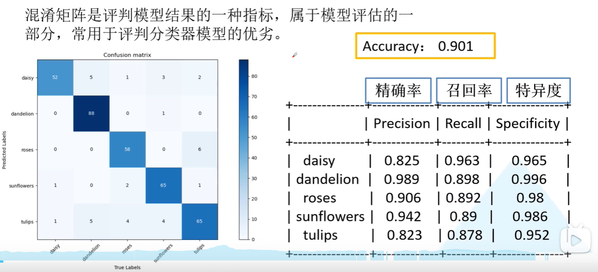
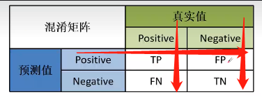

# 分类任务的评价指标

## 混淆矩阵
混淆矩阵通常被用于评价一个分类任务整体的效果，其对角线是每一个类别预测正确的个数。

每一行是预测的结果，每一列是真实的标签值。

## 精确率、召回率、特异度

- TP = True Positive : 模型预测为正，标签为正
- FP = False Positive : 模型预测为正，标签为负
- TN = True Negative : 模型预测为负，标签为负
- FN = False Negative : 模型预测为负，标签为正

因此我们想要 *TP* & *TN* 尽量大，这样模型表现也越好。

上图中，ACC是最为常见的分类任务的指标，其针对的是总样本，也就是验证集整体的数据。计算公式
为：模型预测总正确数 / 验证集样本总数

一个简单的记忆方法:

Precision（精确率） = 上图横线部分数据的计算

Recall（召回率） = 上图左侧竖线部分数据的计算

Specificity（特异度） = 上图右侧竖线部分数据的计算

# 目标检测任务的评价指标

TP、TN、FP、FN、已经在上文中介绍过了，下面补充其在目标检测领域的应用

Precision（查准率） = TP / TP + FP(实际为假) 

即 **预测正确的部分** 占 **预测的所有结果** 的比例

Recall(查全率) = TP / TP + FN(实际为真)

即 **预测正确的部分**  占  **所有正样本**  的比例

查准率和查全率是一对矛盾的度量，一般而言，查准率高时，查全率往往偏低；而查全率高时，查准率往往偏低。
我们从直观理解确实如此：我们如果希望好瓜尽可能多地选出来，则可以通过增加选瓜的数量来实现，
如果将所有瓜都选上了，那么所有好瓜也必然被选上，但是这样查准率就会越低；
若希望选出的瓜中好瓜的比例尽可能高，则只选最有把握的瓜，但这样难免会漏掉不少好瓜，导致查全率较低。
通常只有在一些简单任务中，才可能使查全率和查准率都很高。

## AP

首先介绍PR曲线，即横轴为 Recall，竖轴为 Precision。

而 AP 表示的是检测器在各个 Recall 情况下的平均值，对应的就是 PR 曲线下的面积（AUC， Area Under Curve）

### 如何计算AP以及mAP

以下方图像为例：

#### 1.根据IOU计算TP,FP
首先我们计算每张图的pre和label的IOU，根据IOU是否大于0.5来判断该pre是属于TP还是属于FP。显而易见，pre1是TP，pre2是FP，pre3是TP。

#### 2.排序
根据每个pre的置信度进行从高到低排序，这里pre1、pre2、pre3置信度刚好就是从高到低。

#### 3.在不同置信度阈值下获得Precision和Recall
首先，设置阈值为0.9，无视所有小于0.9的pre。那么检测器检出的所有框pre即TP+FP=1，并且pre1是TP，那么Precision=1/1。因为所有的label=3，所以Recall=1/3。这样就得到一组P、R值。

然后，设置阈值为0.8，无视所有小于0.8的pre。那么检测器检出的所有框pre即TP+FP=2，因为pre1是TP，pre2是FP，那么Precision=1/2=0.5。因为所有的label=3，所以Recall=1/3=0.33。这样就又得到一组P、R值。

再然后，设置阈值为0.7，无视所有小于0.7的pre。那么检测器检出的所有框pre即TP+FP=3，因为pre1是TP，pre2是FP，pre3是TP，那么Precision=2/3=0.67。因为所有的label=3，所以Recall=2/3=0.67。这样就又得到一组P、R值。

#### 4.绘制PR曲线并计算AP值
根据上面3组PR值绘制PR曲线如下。然后每个“峰值点”往左画一条线段直到与上一个峰值点的垂直线相交。这样画出来的红色线段与坐标轴围起来的面积就是AP值。

**当一个Recall对应多个Precision时，只取precision最大的那个值，其余值删除。**

#### 5.计算mAP

mAP = AP / num_classes

