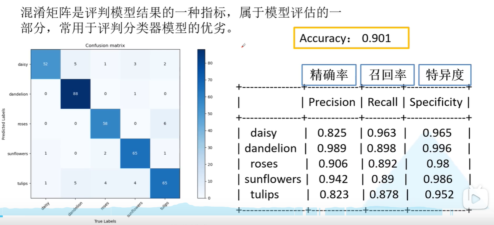
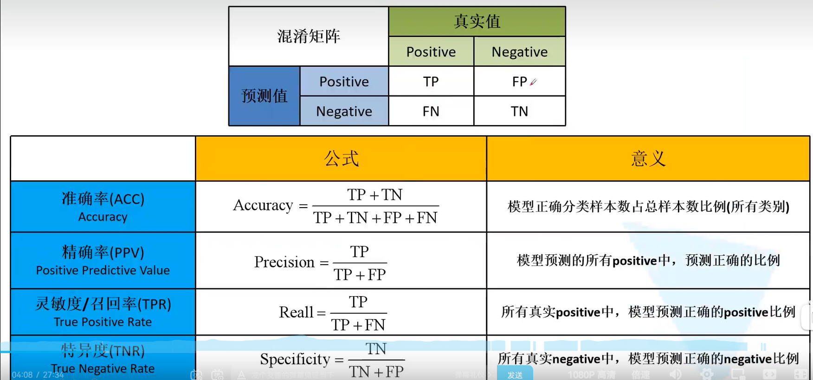
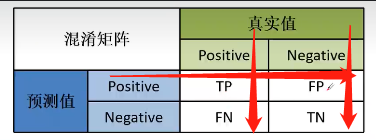

# 分类任务的评价指标

## 混淆矩阵
混淆矩阵通常被用于评价一个分类任务整体的效果，其对角线是每一个类别预测正确的个数。

每一行是预测的结果，每一列是真实的标签值。

## 精确率、召回率、特异度

- TP = True Positive : 模型预测为正，标签为正
- FP = False Positive : 模型预测为正，标签为负
- TN = True Negative : 模型预测为负，标签为负
- FN = False Negative : 模型预测为负，标签为正

因此我们想要 *TP* & *TN* 尽量大，这样模型表现也越好。

上图中，ACC是最为常见的分类任务的指标，其针对的是总样本，也就是验证集整体的数据。计算公式
为：模型预测总正确数 / 验证集样本总数

一个简单的记忆方法:

Precision（精确率） = 上图横线部分数据的计算

Recall（召回率） = 上图左侧竖线部分数据的计算

Specificity（特异度） = 上图右侧竖线部分数据的计算

