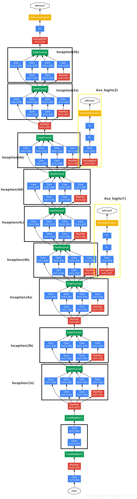

# GoogLeNet

## 创新点：
* 引入了 Inception 结构（融合不同尺度的特征信息）
* 使用1x1的卷积核进行降维以及映射处理 （虽然VGG网络中也有，但该论文介绍的更详细）
* 添加两个辅助分类器帮助训练
* 丢弃全连接层，使用平均池化层（大大减少模型参数，除去两个辅助分类器，网络大小只有vgg的1/20）

### 1、Inception 结构

> 作用 ： **增加网络深度和宽度的同时减少参数**
> 
> 注意：每个分支所得特征矩阵的高和宽必须相同（通过调整stride和padding），以保证输出特征能在深度上进行拼接。

.png "inception(a)")

上图是论文中提出的inception原始结构，将特征矩阵同时输入到多个分支进行处理，并将输出的特征矩阵按深度进行拼接，得到最终输出。

.png "inception(b)")

在 inception 的基础上，还可以加上降维功能的结构，如上图所示，在原始 inception 结构的基础上，在分支2，3，4上加入了卷积核大小为1x1的卷积层，目的是为了降维（减小深度），减少模型训练参数，减少计算量。

### 2、辅助分类器 - Aux_logits

GoogLeNet网络结构如下所示：

> 在训练模型时，将两个辅助分类器的损失乘以权重 **（论文中是0.3）** 加到网络的整体损失上，再进行反向传播。

辅助分类器的两个分支有什么用呢？

作用一：可以把他看做inception网络中的一个小细节，它确保了即便是隐藏单元和中间层也参与了特征计算，他们也能预测图片的类别，他在inception网络中起到一种调整的效果，并且能防止网络发生过拟合。

作用二：给定深度相对较大的网络，有效传播梯度反向通过所有层的能力是一个问题。通过将辅助分类器添加到这些中间层，可以期望较低阶段分类器的判别力。在训练期间，它们的损失以折扣权重（辅助分类器损失的权重是0.3）加到网络的整个损失上。

### 3、网络参数表

对于Inception模块，所需要使用到参数有 *#1x1* , *#3x3reduce*, *#3x3*, *#5x5reduce*, *#5x5*, *poolproj*，这6个参数，分别对应着所使用的卷积核个数。

- #1x1对应着分支1上1x1的卷积核个数
- #3x3reduce对应着分支2上1x1的卷积核个数
- #3x3对应着分支2上3x3的卷积核个数
- #5x5reduce对应着分支3上1x1的卷积核个数
- #5x5对应着分支3上5x5的卷积核个数
- poolproj对应着分支4上1x1的卷积核个数。

